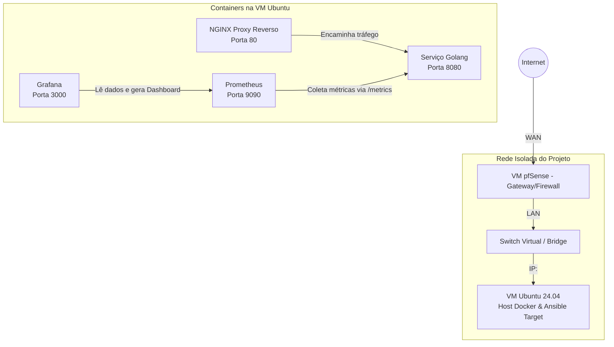

# desafio-korp
Este repositório contém a resolução do desafio técnico para provisionamento de uma infraestrutura baseada em containers, monitoramento e automação. O ambiente foi inteiramente projetado para rodar em um servidor Proxmox utilizando redes isoladas e automação via Ansible.

## Arquitetura do Ambiente (Proxmox)

A infraestrutura foi montada no Proxmox com isolamento de rede, garantindo segurança e resolução de nomes local. O diagrama abaixo ilustra o fluxo da arquitetura:

